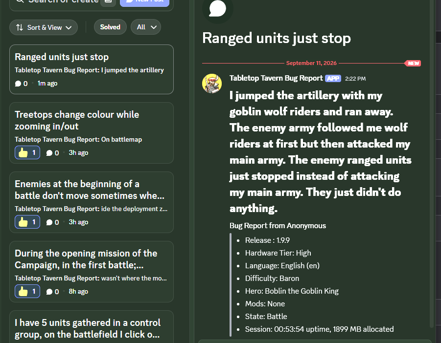

# Privacy Policy - Tabletop Tavern Bug Report Bot

**Effective date:** 11 September 2026
**Operator:** Memori Studios (the developer of Tabletop Tavern)
**Contact:** tj@memoristudios.com

This policy covers the Discord bot that Memori Studios uses to read player bug reports in the
official Tabletop Tavern Discord server. It is written to be read in a minute, because the bot does
very little.

## What the bot is for

Players submit bug reports from inside Tabletop Tavern. Those reports are posted into the
`#report-a-bug` forum channel of the Tabletop Tavern Discord server. The bot exists so the
developer can read those reports from a development machine, sort them, and turn them into work
items. That is its only job.

## What the bot can access

The bot is installed with the **View Channels** and **Read Message History** permissions and uses
the **Message Content** intent. It reads:

- The title, text, attachments and reply count of threads in the `#report-a-bug` forum channel.
- The game-generated details the in-game reporter attaches to each report: game version, hardware
  tier, language, difficulty, hero, mods in use, game state, session length and memory use, and an
  optional log file. The report also carries the player's Steam display name unless they tick the
  option to hide it (the report then reads "Anonymous"), and a Discord handle only if the player
  typed one into the report form.
- The Discord username shown on those messages.

The bot does not read direct messages, member lists, presence or activity status, voice, or any
channel other than the bug-report channel. It does not send messages, react, moderate, or take any
action in the server.

This is what the channel and a typical report look like:

## What we do with it

- **Triage.** The developer reads a report and decides whether it is a bug, what causes it, and
  whether it needs a fix.
- **Work tracking.** A report may be copied into the developer's private task tracker (Notion) so
  the fix can be scheduled and tested. The copy typically contains the report text and the Discord
  username, so the developer can follow up in the thread.
- **AI-assisted analysis.** Reports may be summarised and analysed with AI-assisted development
  tools provided by Anthropic (Claude) to help find the cause of a bug. Report text sent to those
  tools is processed under Anthropic's own privacy terms and is not used by Memori Studios for any
  other purpose.

We do not use bug reports for advertising, profiling, or anything unrelated to fixing the game,
and we do not sell or rent any of this data.

## Storage and retention

- The bot itself does not run a database and does not keep a copy of messages. Each read is a
  one-off request to Discord's API from the developer's computer.
- Reports copied into the task tracker are kept for as long as they are useful for fixing and
  verifying the bug, and are deleted or anonymised when they are no longer needed.
- Anything the game itself attaches to a report (for example a log file) is already scrubbed of
  local user paths before it is sent to Discord.

## Sharing

Report contents are seen by the Memori Studios developer and by the services named above (Discord,
Notion, and Anthropic's Claude), each under their own privacy policies. They are not shared with
anyone else.

## Your choices

- You can delete or edit your own posts in `#report-a-bug` at any time. Deleting a post also
  removes it from anything the bot can read.
- If you want a report removed from the developer's task tracker as well, contact us at the
  address above and name the report. We will remove it.
- If you would rather not have a report read by the bot at all, do not post it in
  `#report-a-bug`; you can send it to the contact address instead.

## Children

The Tabletop Tavern Discord server follows Discord's own minimum age requirements. The bot does
not knowingly collect information from anyone below that age.

## Changes to this policy

If the bot gains new permissions or new uses, this document will be updated and the effective date
changed. The current version is always at the URL where you are reading it.
